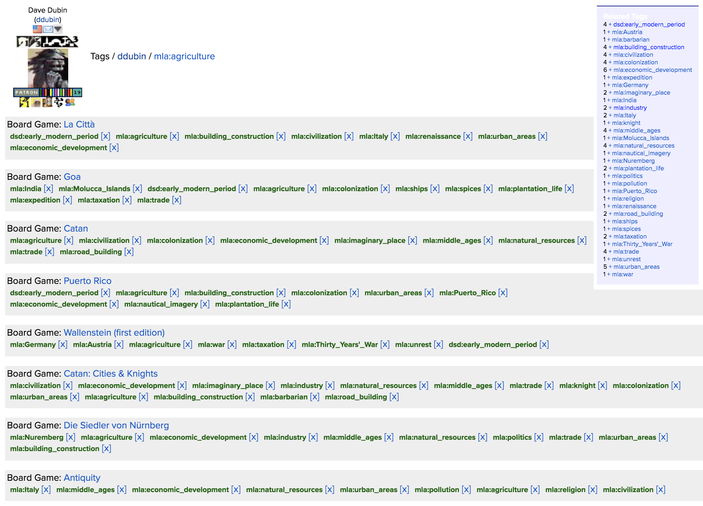

# Subject Languages

- Subject languages have vocabularies, semantics, and semantics.
- The first important distinction is what *kind of thing* is a topic or subject
    - Are things in the world topics? If so, your subject language might be an ontology.
    - Or are topics conceptual? In that case, a thesaurus, subject headings, or a classification.

- Syntax: how lexemes are allowed to be combined.
- Semantics: how grammatical strings relate to each other and to what they denote.

# MLA Thesaurus Terms

\

# Coordinate index terms vs. subject headings

- Compare these MLA thesaurus terms: Italy; renaissance; Urban areas; civilization; economic development;
- With these LCHS:
    - Cities and towns, Renaissance
    - Italy--Commerce
    - Italy--History--1268-1492
    - Italy--Civilization

# LC Classification

- A. General Works
- B. Philosophy. Psychology. Religion
- C. Auxiliary Sciences of History
- D. World History and History of Europe, Asia, Africa, Australia, New Zealand, etc..
- E. History of the Americas
- F. History of the Americas
- G. Geography, Anthropology, and Recreation
- H. Social Sciences
- J. Political Science
- K. Law
- L. Education
- M. Music
- N. Fine Arts
- P. Language and Literature
- Q. Science

(etc.)

# Class Q – Science

- Subclass Q – Science (General)
- Subclass QA – Mathematics
- Subclass QB – Astronomy
- Subclass QC – Physics
- Subclass QD – Chemistry
- Subclass QE – Geology
- Subclass QH – Natural history – Biology
- Subclass QK – Botany
- Subclass QL – Zoology
- Subclass QM – Human anatomy
- Subclass QP – Physiology
- Subclass QR – Microbiology

